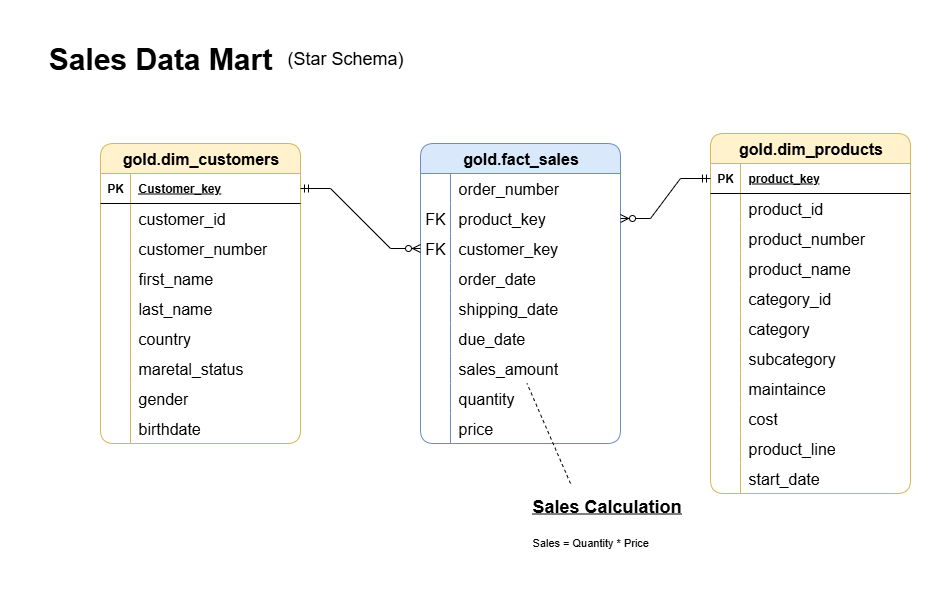
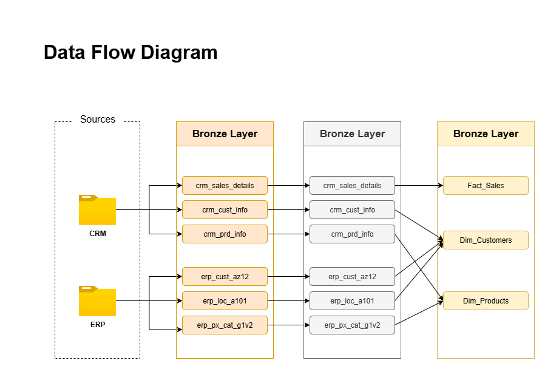
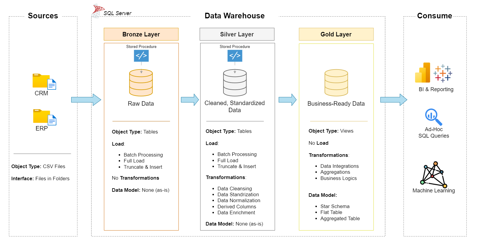

# 📊Sales Data Warehouse & Analytics Project

Welcome to the **Sales Data Warehouse and Analytics Project** repository! 🚀  
This project demonstrates a **modern data warehousing and analytics solution** using the **Medallion Architecture (Bronze, Silver, Gold layers)**.  

---
## Sales Data Mart

## Data Flow Diagram

 

## 🏗️ Architecture Overview

  

The project follows the **Medallion Architecture**:

- **Bronze Layer** 🟤  
  - Stores **raw data** ingested from source systems (ERP & CRM in CSV format).  
  - Data is loaded into **SQL Server Database** without transformations.  

- **Silver Layer** ⚪  
  - Data cleansing, standardization, and normalization.  
  - Resolves **data quality issues** and integrates data across sources.  

- **Gold Layer** 🟡  
  - Houses **business-ready data**.  
  - Modeled using **Star Schema** (Fact & Dimension tables).  
  - Optimized for reporting and analytical queries.  

---

## 📖 Project Overview

This project includes:

- **Data Architecture**: Modern **Data Warehouse** using Medallion design.  
- **ETL Pipelines**: Extract, Transform, Load from CSV → SQL Server.  
- **Data Modeling**: Fact & Dimension tables for analytics.  
- **Analytics & Reporting**: SQL-based insights & dashboards for business stakeholders.  

---

## 🚀 Project Requirements

### 🔹 Data Engineering (Building the Warehouse)
**Objective**  
Develop a **modern data warehouse** in SQL Server to consolidate **sales data** from ERP & CRM, enabling analytical reporting.

**Specifications**
- **Data Sources**: ERP & CRM datasets (CSV files).  
- **Data Quality**: Cleanse, standardize, deduplicate.  
- **Integration**: Unified **analytical data model**.  
- **Scope**: Latest dataset only (no historization).  
- **Documentation**: Entity Relationship Diagrams (ERD) & schemas.  

---

### 🔹 Data Analysis (BI & Reporting)
**Objective**  
Generate **insights** into customer & sales performance using SQL-based queries & dashboards.

**Focus Areas**
- **Customer Behavior** → Retention, Segmentation.  
- **Product Performance** → Top/Low performing products.  
- **Sales Trends** → Revenue growth, seasonal trends.  

